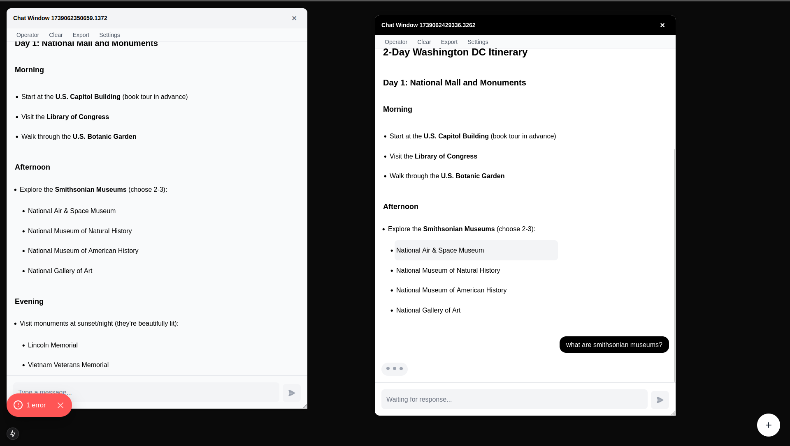

# AI WINDOWS
A UI wrapper for all chat LLMs, designed for brainstorming and research.
Regular chat interface, tap on any response from the LLM to start a new thread. Particularly useful when you want to ask clarifying questions about a part of the LLM response, without breaking the thread of conversation. 

Runs locally. You provide your Claude/OpenAI/Groq/DeepSeek api keys to be used. 



# Setup 
```
$ npm run dev
```

Open `localhost:3000` (default) on browser.
Tap on the (+) on the bottom right to open a new chat.
Tap on settings inside a chat to add an api key for a new LLM.
Switch between LLMs from the Operator menu.